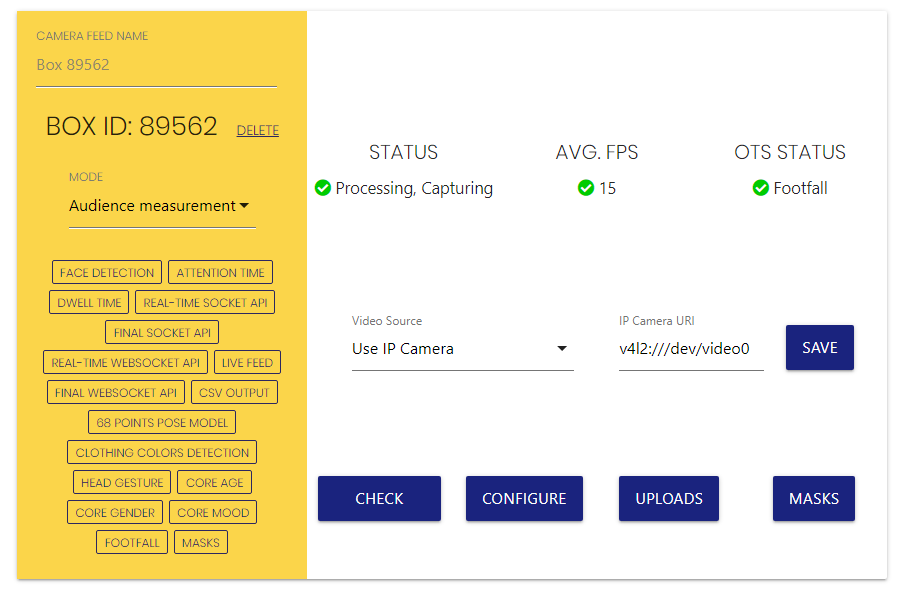

# BroadSign Player - Docker

This repository holds the necessary Dockerfiles for the auto-install Ubuntu image.

The required components are already included in the mentioned Ubuntu image, which are:

* /opt/assets/bsp
* /opt/assets/control-player-ubuntu.deb
* /opt/assets/vidireports.sh
* /opt/assets/configure_vidireports.sh

# Notes

It is extremely important to run this image using Ubuntu on Wayland only. Otherwise BroadSign Player glitches out.

# Usage

1. Clone or copy the repo inside `/opt/`.
2. Create the necessary volumes for the images before building:

```
$ sudo docker volume create --name=broadsign-player-data
$ sudo docker volume create --name=vidireports-data
```

3. Build the image (If you are running this from an external process such as ansible, set `DISPLAY=:0` before running the build process). 

```
$ sudo docker-compose build
```

4. Run the image and then provision Vidireports with all available cameras.

```
$ xhost +local:docker
$ sudo docker-compose up -d && sudo docker exec -it vidireports sc -h "/configure_vidireports.sh" \
    sudo docker-compose restart -t 0
```

Normally with VidiReports you'd fetch any connected cameras automatically. Since this is a container, you'll need to configure each camera feed with `v4l2:///dev/your_device` (`your_device` being the volume mounted on the Docker image. By default `/dev/video0`) as an "IP Camera" (See image below).


